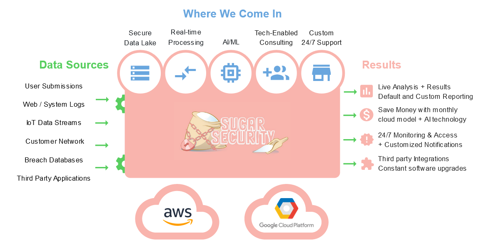

# Company Update - Fall 2020
It's almost October - Cybersecurity Awareness Month. We're a new company, and already very busy with all of the things that entails.
We are mostly focused on product development now, but Cybersecurity Awareness Month has us turning the marketing/sales up a notch. 

## Cybersecurity Awareness Month
Expect infographics, blog updates, and probably a sales call. We hope we can teach you something valuable and learn more about the cybersecurity of your business. We think we can help! 

Think of us like a next-gen MSSP in the cloud, providing small IT teams powerful cybersecurity tools, insights, and support.

## November + December
Sugar Security highly values family and charity. These are holiday months so we are turning everything except the tech down to a simmer until 2021. 

## 2021
Major tech upgrades, blogs, then sales
