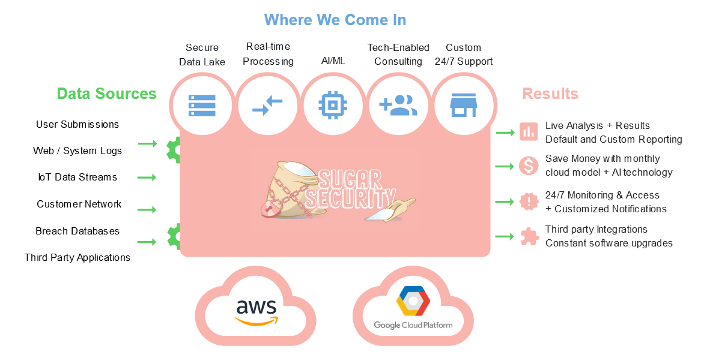

# Adapting from Pentesting to Real-Time Vulnerability Scanning

Organizations need to make the upgrade from disjointed penetration tests and MSSP services to a centralized and real-time solution. In the first half of 2020, [27 billion data records were exposed](https://pages.riskbasedsecurity.com/en/2020-mid-year-data-breach-quickview-report), including personal information, login credentials, financial data, PHI health records, and more. Covid-19 added to this, with [Trend Micro finding 9 million Covid-19-related threats](https://www.trendmicro.com/vinfo/us/security/research-and-analysis/threat-reports/roundup/securing-the-pandemic-disrupted-workplace-trend-micro-2020-midyear-cybersecurity-report) between January to June 2020. Many cyber-criminals specifically target smaller businesses, which are seen as ‘low hanging fruit’ with fewer resources available to prevent a cyber-attack. 

When we look at the cyber-threat situation, it feels as if cybersecurity is out of control. Just as one vulnerability or entry point is closed, another opens. The SMB is always on the run, playing catch-up as cybercriminals forge ahead, innovating around cybercrime.

But help is here. Real-Time Vulnerability Detection is a technique that is managed on behalf of an SMB, giving them the tools to turn the tables on cybercrime. Discussed here, are some of the aspects of cyber-attacks that have led to the development of this innovation in threat detection.

# Vulnerabilities and threats gone mad

Understanding where the problems lie can help to decide what the risk levels are. In Q1 and Q2 of 2020, there were [2.5 times more security attacks](https://www.home.neustar/resources/whitepapers/cyber-threats-and-trends-report-2020-first-half) than in the same period in 2019. One of the problems in dealing with cyber-threats is that they are facilitated by the very technology that provides the modern business with innovative tools like online apps, etc. 

Cloud computing, and increasingly connected workplaces, mean that data is accessed from anywhere. This has been a real benefit during the Covid-19 pandemic where remote working is the new normal. But remote workers and contractors make it much harder to control which devices are used to access apps and data. ShadowIT, personal device use, and connectivity across insecure networks, etc., open digital doors for cybercriminals to enter networks. 

## The Costs of a Cyber-Attack on an SMB

SMBs have to deal with the multiple whammies of cybercrime. The SMB is a target because of a lack of IT resources to shore up defenses. And a cyber-attack can be very costly to deal with. A [survey by insurer Hiscox](https://www.hiscox.com/documents/2019-Hiscox-Cyber-Readiness-Report.pdf) found the average cost to an SMB affected by a cyber-attack is $200,000.  The report stating that: 

“where hackers formerly focused mainly on larger companies, small-and-medium -sized firms are now equally vulnerable.”

# What is a small business to do?

In an attempt to deal with the complexities of cybersecurity, cybersecurity professionals use a few techniques and approaches. These are typically based on the processes involved in prevention, detection, and response to cyberthreats. Two key examples are MSSPs (Managed Security Service Providers) and Penetration Tests (or Ethical Hackers). These both have major flaws that Sugar Security is working to address in a next-gen solution. 

## Five drawbacks of penetration testing:

Penetration testing (or “a pentest”) is carried out by cybersecurity professionals who test a system against known attack types. The testing looks for vulnerabilities in a network, application, or other compute function that cybercriminals could exploit. The pen testers attempt to act like a hacker looking for flaws in your technology and processes; pen testing usually looks for human errors too. A Pentest can be a useful way to find out inherent issues in an IT system. However, on its own, it has some drawbacks including:

### 1. Pentests quickly go out of date

The cyber-threat landscape is always changing as cybercriminals find new ways to attack a company. Fraud, such as Business Email Compromise (BEC), is highly complicated and includes both technological and human elements along with social engineering. As the landscape changes, previous Pentests become quickly outdated. It is a challenge to ensure that Pentest results reflect the changing cybersecurity threat landscape. To get benefit from a penetration test they need to be carried out regularly, which leads to drawback two.

### 2. Pentests can be expensive

Pentests require the expert knowledge of cybersecurity professionals who understand how to search for vulnerabilities. The process of pen testing also has a large manual element to it. This means it can be a costly process. Also, because pen tests need to be done regularly, costs soon stack up.

### 3. Pentests use old school vulnerability scanning

Traditional vulnerability scanning is often used to help find vulnerabilities during a Pentest. However, this method is limited. The scanning is not performed in real-time. As such, it is retrospective and misses new exploits. Vulnerability scans need to part of a real-time vulnerability detection kit to be effective in the ever-changing cyberthreat landscape.

### 4. Pentests don’t cover it all
Pentests are designed to look across your network and beyond but they can easily miss places where hackers can gain entry. Technology ecosystems are often based on cloud computing that allows employees and others to access apps and data using mobile devices and even IOT devices. ShadowIT is also a problem. This is where remote employees, off-site workers, and even those in the office use devices to access resources without the full knowledge of an IT team. Pentests may not cover all of the possible endpoints in such disparate ecosystems. 

### 5. Pentests can be inconsistent
Consistency and quality can be hard to guarantee. Pen testers are human beings and pen testing requires a high-degree of creativity – you must think like a hacker. Many factors must be considered, and the result is inconsistencies in quality. This also leaves gaps in the auditability of pen testing.

## Five Drawbacks of MSSPs

In addition to penetration tests, many SMBs rely on Managed Security Service Providers, or MSSPs. You can think of an MSSP like a cybersecurity help desk. This model also has it's challenges, for many of the same reasons as penetration tests. 

### 1. MSSPs are Expensive
Yes, just like penetration tests, the average MSSP is simply outside of the budget of most small businesses. MSSPs become higher quality once you start paying for enterprise level service, but these contracts can run into the hundreds of thousands annualy. 

### 2. High Turnover
Behind every MSSP is a team of people. People can be lazy, or they can quit, which requires a new person to be trained up. Does that sound like something your organization wants to be paying for? Software-based solutions run 24/7 and can be "updated" much easier than a person. 

### 3. Limited Support and Guidance
Most MSSPs, especially at the lower tiers of payment agreements, will simply watch and alert you of security incidents. They don't offer insights as to *why* something might be behaving strangely, or *how* you go about fixing it. Any sort of additional support will cost you extra, and you might be paying for more expertise than the MSSP can provide. 

### 4. Inconsistency and Miscommunication
Your main point-of-contact with an MSSP is usually going to be an account manager, or someone else with a support/service specialty. They aren't technical, but they try their best to get your message to the technical people behind the scenes over phone call, email, or Zoom meeting. This doesn't always work, and signals get crossed. With a cloud-based software solution, the data you put when you sign up gets saved in the cloud, and everyone is on the same page. 

### 5. Slow Moving
Again, being mostly people-based, an MSSP has a lot of beaurocracy weighing it down. If a new vulnerability comes out, management first has to get approval to create a new process. Then the new process needs to be drafted up and a technical team assigned, and by that point the hackers may have gotten in. A cloud-based scanner like Sugar Security ensures every customer is getting the same latest and greatest version of our scans.

# In with the new: Real-Time Vulnerability Detection 

A simple answer is that cyber-threats happen in real-time so the response must also be real-time.

Using the services of a dedicated and security-focused MSP is part of the movement towards containing and managing cyber-threats. A Managed Security Services Provider (MSSP) offers the level of cybersecurity know-how that can shore up the internal resources of an organization. However, these threats need to be identified using smart tools that work in real-time. The advent of Real-Time Vulnerability Detection provides the level of detection needed in the fast-moving threat landscape. 

## How Real-Time Vulnerability Detection Works
Looking for vulnerabilities as they happen is the key to threat detection. Data exists in many places at once in a modern cloud-based infrastructure. It can be very difficult for an SMB or indeed any sized organization, to know where data is being accessed from, by whom, and where that data goes.  An MSSP that offers Real-Time Vulnerability Detection uses smart technologies like machine learning, a form of artificial intelligence, to extrapolate patterns of data use and spot anomalies, such as the profile of a cyber-attack. 

Real-Time Vulnerability Detection tools that are delivered by an MSSP, as-a-service, can spot an exploit, as it happens, but also prioritize it according to risk level. These tools also offer remediation tips, adding instant benefits to help build up the expertise level of the customer. Using a serverless cloud architecture designed for small business use allows for easy customization and globally scalable solutions that fit a wide variety of small business security functions. This includes malware and phishing analysis, vulnerability scans, breach monitoring, log analysis, and more.

Cybersecurity threats are ever-changing. Cybercriminals don’t sit back and wait for you to open your doors to your network. Instead, they go out and proactively look for ways to deliver ransomware (or other malware) and steal login credentials and data. The SMB has to also be proactive to cyber-threat detection to keep defenses up to date and working in real-time. 

If you want to see what a Next-Gen MSSP can offer your business, sign up @ https://sugarsecurity.com
